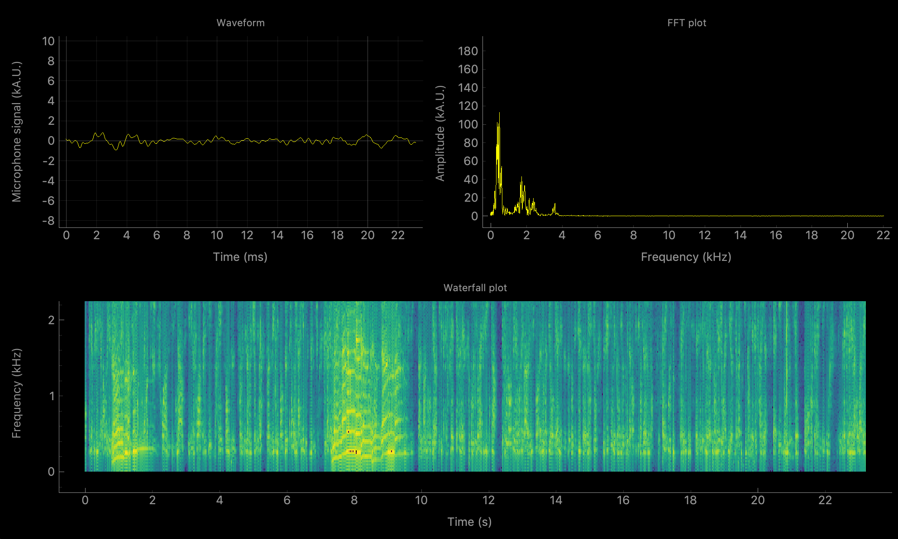

pyqtgraph-spectrographer
========================

This is a simple app to display a live spectrogram from microphone input (including waveform and frequency domain).

Installation
------------

Assuming you have git cloned the repo and have a command prompt in the cloned directory,
you can use `conda` to create an environment with all necessary dependencies:

>>> conda env create -f environment.yml

Note: I have developed this on MacOS and found out that using pyaudio (bindings for PortAudio) required additional
steps such as installing PortAudio using brew. YMMV.

Usage
-----

From the root directory, activate the conda environment with the dependencies and run main.py

>>> conda activate spectrographer
>>> python main.py